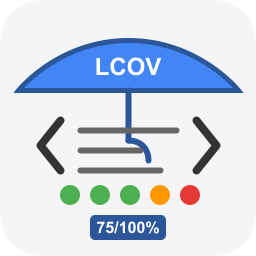

# LCOV Line Coverage Extension for Lucee



This extension provides LCOV code coverage reporting capabilities for Lucee CFML applications.

What is line coverage? It a report of what code was executed either by some sort of testing, which allows you to see which parts of the code based aren't being used or tested.
> **Note**
>
> CURRENTLY still in early BETA, WIP subject to change, not yet published!
CURRENTLY still in early BETA, WIP subject to changed, not yet published!

## Features

- Parse execution log files (.exl) generated by Lucee's Execution Logging https://docs.lucee.org/recipes/execution-log.html
- Generate LCOV format reports compatible with standard coverage tools
- Create HTML reports with detailed line-by-line coverage visualization
- Support for multiple time unit displays (seconds, milliseconds, microseconds, nanoseconds)
- AST-based source code analysis for accurate line counting (TBD)
- Coverage statistics and reporting utilities
- Can handle processing large logs from a single test suite execution run `option ={ separateFiles: true }`

## Limitations

This extension consumes the Execution Logs from Lucee, it currently doesn't consider some block elmements as being executed, i.e. switch, component, function, etc

## HTML Reports


## VS Code

The LCOV files produced by this extension can be visualised in VSCODE
https://marketplace.visualstudio.com/items?itemName=ryanluker.vscode-coverage-gutters


## Components

### Extension Functions

The extension provides easy-to-use functions for code coverage analysis:

- **lcovStartLogging(adminPassword, executionLogDir="", options={})** - Start execution logging with ResourceExecutionLog
- **lcovStopLogging(adminPassword, className="lucee.runtime.engine.ResourceExecutionLog")** - Stop execution logging
- **lcovGenerateAllReports(executionLogDir, outputDir, options={})** - Generate LCOV, HTML, and JSON reports
- **lcovGenerateLcov(executionLogDir, outputFile="", options={})** - Generate LCOV format file only
- **lcovGenerateHtml(executionLogDir, outputDir, options={})** - Generate HTML reports only
- **lcovGenerateJson(executionLogDir, outputDir, options={})** - Generate JSON reports only
- **lcovGenerateSummary(executionLogDir, options={})** - Generate coverage statistics only

## Options

The `options` struct can include the following configuration parameters:

### General Options
- **verbose** (boolean, default: false) - Enable verbose logging during processing
- **displayUnit** (string, default: "micro") - Time unit for display: "nano", "micro", "milli", "second"
- **unit** (string, default: "micro") - Time unit for execution logging: "nano", "micro", "milli", "second"
- **minTime** (numeric, default: 0) - Minimum execution time threshold for logging

### File Filtering
- **allowList** (array, default: []) - Array of file paths/patterns to include (when specified, only these files are processed)
- **blocklist** (array, default: []) - Array of file paths/patterns to exclude from processing

### HTML Report Options
- **separateFiles** (boolean, default: false) - Generate separate HTML files for each source file instead of by execution run
- **title** (string, default: "Code Coverage Report") - Title for HTML reports
- **includeTimestamp** (boolean, default: true) - Include timestamp in report headers

### AST Options
- **useAstForLinesFound** (boolean, default: true) - Use AST-based analysis for accurate executable line counting

### Execution Logging Options
- **className** (string, default: "lucee.runtime.engine.ResourceExecutionLog") - Java class name for execution logging
- **executionLogDir** (string, default: auto-generated) - Directory for storing .exl execution log files

### Example Options Usage

```cfml
var options = {
	verbose: true,
	displayUnit: "milli",
	allowList: ["/app", "/lib"],
	blocklist: ["/testbox", "/specs", "{lucee-config}"],
	separateFiles: true,
	title: "My Application Coverage Report",
	useAstForLinesFound: true,
	minTime: 100 // Only log executions > 100 microseconds
};
```

### Core Components

- **ExecutionLogParser** - Parses Lucee .exl execution log files with verbose logging
- **codeCoverageUtils** - Utility functions for coverage calculations and data processing
- **HtmlReporter** - Generates HTML coverage reports with dependency checks
- **HtmlWriter** - Handles HTML content generation with customizable time units
- **ExecutableLineCounter** - AST-based source code analysis for line counting
- **exeLogger** - Utility component to enable/disable execution logs
- **LcovFunctions** - Main component providing all extension functions

### Usage

The extension functions are automatically available once installed.

**IMPORTANT:** ResourceExecutionLog only works on NEW requests after `enableExecutionLog()`. You must use `internalRequest()`, `cfhttp`, or similar to make a new request for logging to occur. Code executed in the same request as `enableExecutionLog()` will NOT be logged.

Use them in your CFML code like:

```cfml

codeCoverageDir = ""/path/to/resourceExecutionlogs";

// Start execution logging
var logDirectory = lcovStartLogging(
    adminPassword = "your-admin-password",
    executionLogDir = codeCoverageDir,  // Optional: specify directory, or leave empty for auto-generated
    options = {
        unit: "milli",
        minTime: 0,
        className: "lucee.runtime.engine.ResourceExecutionLog"
    }
);

// Run your tests or application code here
// CRITICAL: Must use internalRequest() for logging to work!
internalRequest(
    template = "/your/test/runner.cfm",
    throwonerror = true
);
// or
internalRequest(
    template = "/your/application/entry-point.cfm",
    throwonerror = true
);

// Stop execution logging
lcovStopLogging(adminPassword = "your-admin-password");

// Generate all report types (LCOV, HTML, JSON)
var options = {
    verbose: true,
    allowList: [],
    blocklist: [expandPath("/testbox"), expandPath("/specs"), expandPath("{lucee-config}")],
    displayUnit: "milli"
};

var result = lcovGenerateAllReports(
    executionLogDir = codeCoverageDir,
    outputDir = "/path/to/reports",
    options = options
);

// Or generate individual report types:
// lcovGenerateLcov(executionLogDir=codeCoverageDir, outputFile="/path/to/lcov.info", options=options);
// lcovGenerateHtml(executionLogDir=codeCoverageDir, outputDir="/path/to/html", options=options);
// lcovGenerateJson(executionLogDir=codeCoverageDir, outputDir="/path/to/json", options=options);
```

[Examples](examples/coverage.cfm)

## Installation

Install the extension through the Lucee Administrator or deploy the .lex file manually.

## Requirements

- Lucee 7.0.0.372-SNAPSHOT or higher
- Java 11+

## License

GNU Lesser General Public License, Version 2.1

## Contributing

Contributions are welcome! Please submit issues and pull requests to the GitHub repository.
